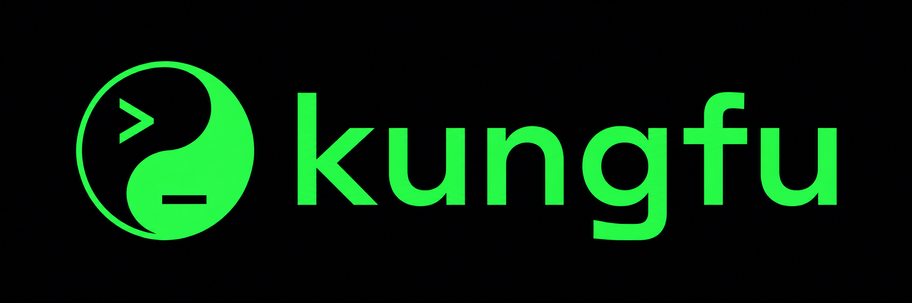

<p align="center">
  
</p>

<h1 align="center">kungfu</h1>

<p align="center">
  <i>The package manager for your agent skills. One CLI, every agent.</i>
</p>

<p align="center">
  <a href="https://github.com/mjcurry/kungfu/actions/workflows/ci.yml"></a>
  <a href="https://github.com/mjcurry/kungfu/releases/latest"></a>
  <a href="LICENSE"></a>
  <a href="go.mod"></a>
</p>

`kungfu` installs, lints, scaffolds, and updates [Agent Skills](https://agentskills.io)
— `SKILL.md` directories that teach AI agents a new capability via the
progressive-disclosure pattern. One CLI manages the same skill across every
agent on your machine: **Claude, Codex, Cursor, and Copilot**. Skills you
install from GitHub carry version provenance so a later `kungfu update` brings them
back into sync with one command.


<p align="center">
  
</p>

<!-- TODO: replace the GIF above with a recorded asciinema cast of
     new → lint → install → list → update, ~30 seconds, no cuts. -->

## Install

### curl | sh (macOS, Linux)

```sh
curl -fsSL https://raw.githubusercontent.com/mjcurry/kungfu/main/install.sh | sh
```

The script detects your OS / arch, downloads the matching archive from the
[latest release](https://github.com/mjcurry/kungfu/releases/latest), verifies
its sha256 checksum, and drops the binary into `/usr/local/bin` (or
`$HOME/.local/bin` if `/usr/local/bin` is read-only).

### go install

```sh
go install github.com/mjcurry/kungfu/cmd/kungfu@latest
```

### Manual download

Grab a `kungfu_<version>_<os>_<arch>.tar.gz` (or `.zip` on Windows) from the
[releases page](https://github.com/mjcurry/kungfu/releases), verify against
the matching `kungfu_<version>_checksums.txt`:

```sh
shasum -a 256 -c kungfu_<version>_checksums.txt
```

then move `kungfu` somewhere on your PATH.

> A Homebrew tap is on the roadmap once the project lands a few real users;
> until then, the installer script above is the recommended path on macOS
> and Linux.

## Quickstart

```sh
# 1. Scaffold a new skill from a built-in template, lint-clean by construction:
kungfu new csv-formatter
kungfu lint csv-formatter

# 2. Install a skill you already have on disk:
kungfu install ./csv-formatter --target claude,codex,cursor,copilot

# 3. Or fetch one from GitHub (provenance gets recorded for updates):
kungfu install https://github.com/nextlevelbuilder/ui-ux-pro-max-skill \
    --target claude,codex,cursor,copilot

# 4. See what's installed where:
kungfu list

# 5. Read a skill the way an agent would:
kungfu show ui-ux-pro-max-skill

# 6. Bring everything tracking a moving ref up to date:
kungfu update --all
```

## Installing skills

`kungfu install <source>` accepts **either a local directory or a GitHub
source**; the same `--target`, `--scope`, `--force`, and `--dry-run` flags
apply to both.

### From a local path

Any directory that contains a `SKILL.md`, relative or absolute:

```sh
kungfu install ./csv-formatter
kungfu install /Users/mike/work/skills/csv-formatter
kungfu install ./csv-formatter --target claude,codex --force
```

Local installs **do not** stamp provenance — the source lives on your
machine, not a commit you can refetch.

### From GitHub

A GitHub source can be written several ways; pick whichever you have
handy (browser URL, `user/repo` shortcut, etc.):

| Source                                                                                | Meaning                                            |
| ------------------------------------------------------------------------------------- | -------------------------------------------------- |
| `nextlevelbuilder/ui-ux-pro-max-skill`                                                | default branch                                     |
| `nextlevelbuilder/ui-ux-pro-max-skill@v1.0.0`                                         | tag (or branch / short SHA / full SHA)             |
| `nextlevelbuilder/ui-ux-pro-max-skill/path/to/skill`                                  | subdirectory inside the repo                       |
| `nextlevelbuilder/ui-ux-pro-max-skill/path/to/skill@v1.0.0`                           | subdirectory at a specific ref                     |
| `github.com/nextlevelbuilder/ui-ux-pro-max-skill[…]`                                  | same forms with an explicit host                   |
| `https://github.com/nextlevelbuilder/ui-ux-pro-max-skill[…]`                          | a pasted browser URL                               |

Each remote install stamps the destination's frontmatter with provenance so
a later `kungfu update` knows where the skill came from:

```yaml
kungfu_source: github.com/nextlevelbuilder/ui-ux-pro-max-skill
kungfu_ref: v1.0.0
kungfu_sha: a1b2c3d4e5f6…           # 40-char commit SHA
kungfu_installed_at: 2026-05-19T03:04:05Z
```

Tarballs are cached at `$XDG_CACHE_HOME/kungfu/tarballs/` for 7 days. Use
`--no-cache` to bypass, `--ref` to set the ref via flag, and `--yes` to skip
the pre-install confirmation.

## Supported agents

| Agent     | Personal scope        | Project scope        | Status |
| --------- | --------------------- | -------------------- | ------ |
| Claude    | `~/.claude/skills`    | `.claude/skills`     | ✅      |
| Codex     | `~/.codex/skills`     | `.codex/skills`      | ✅      |
| Cursor    | `~/.cursor/skills`    | `.cursor/skills`     | ✅      |
| Copilot   | `~/.copilot/skills`   | `.github/skills`     | ✅      |

The format every agent reads is described in [docs/skill-format.md](docs/skill-format.md).

## Commands

| Command            | What it does                                                       |
| ------------------ | ------------------------------------------------------------------ |
| `kungfu new`       | Scaffold a new skill from a built-in template (lint-clean).        |
| `kungfu lint`      | Validate a skill against the rule set (stable, grep-able IDs).     |
| `kungfu install`   | Install from a local path or a GitHub source.                      |
| `kungfu list`      | List installed skills across configured targets.                   |
| `kungfu show`      | Print a skill's metadata + body (markdown-rendered).               |
| `kungfu remove`    | Remove a skill from one or more targets.                           |
| `kungfu update`    | Re-fetch a previously-installed skill using its stored provenance. |
| `kungfu version`   | Print build info (also `--json`).                                  |

Full flag listing, exit codes, and examples in [docs/commands.md](docs/commands.md).

## How it works

`SKILL.md` is an [open, cross-agent format](https://agentskills.io). Every
supported agent agrees on the directory shape — frontmatter on top,
progressive-disclosure markdown below, optional `scripts/`, `references/`,
`assets/` subdirectories. `kungfu` is disciplined file management over that
format, not agent-specific magic.

When you `kungfu install user/repo`, the skill is fetched from GitHub
(tarball, checksum-verified, cached at `$XDG_CACHE_HOME/kungfu/tarballs/`),
linted before it is allowed near your skills directories, then atomically
copied into each configured target via a `.tmp-<random>` → rename → cleanup
sequence that survives interruption. Four provenance fields are appended to
the installed `SKILL.md` (see above), and `kungfu update` reads them back
to refresh the skill in place.

Skills you created with `kungfu new` or installed from a local path have no
provenance and are skipped by `update` — they aren't on a remote leash.

## Roadmap

Beyond v1:

- **More hosts.** GitLab, Bitbucket, Codeberg, and self-hosted Git via an
  http URL grammar.
- **`kungfu publish`** that pushes a skill to a tap-style index.
- **`kungfu search`** against a public skill directory.
- **`kungfu test`** that runs a skill's bundled `scripts/test.sh` (or
  language-detected runner) so reviewers don't have to.
- **`kungfu doctor`** that diagnoses common misconfigurations (missing
  targets, stale caches, broken paths).
- **`kungfu cache`** subcommands (`list`, `clear`, `verify`).
- **Recorded demo** under `docs/demo.cast`.

## Contributing

Issues and pull requests are welcome. Run the full check suite before
opening a PR:

```sh
make test     # go test ./...
make lint     # go vet + gofmt -l
make build    # ./bin/kungfu
```

Releases are tag-driven via goreleaser; see [docs/release.md](docs/release.md).

## License

[MIT](LICENSE) © Mike Curry.

<p align="center">
  
</p>
